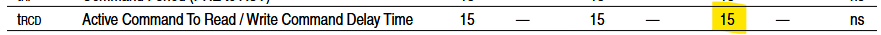
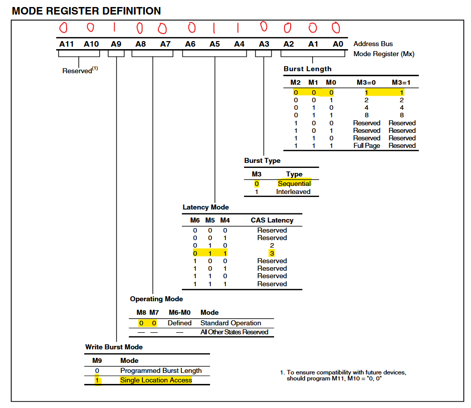

**Reference** : [ST-community](https://community.st.com/t5/stm32-mcus/how-to-set-up-the-fmc-peripheral-to-interface-with-the-sdram/ta-p/49457) ⇐ Please read this for more information

## HCLK `180MHz`

## SDRAM common clock `2 HCLK clock cycles`

    - SD clock frequency =  (180MHz / 2) = 90MHz (11.11ns)

## CAS latency `3 memory clock cycles`

## Load mode register to Active delay = 2


## Exit self-refresh delay = 7

- **ROUND_UP( tXSR / SDRAM_CLK_Period )** = `ROUND_UP( 70ns / 11.11ns ) = 7`


## Self-refresh time = 4

- **ROUND_UP( tRAS / SDRAM_CLK_Period)** = `ROUND_UP( 42ns / 11.11ns ) = 4`


## SDRAM common row cycle delay = 7

- **ROUND_UP( tRC / SDRAM_CLK_Period)** = `ROUND_UP( 63ns / 11.11ns ) = 6` ⇒ 7


## Write recovery time (TWR) = 3

- tWR >= tRAS - tRCD = ( 4 - 2) ⇒ 3


## SDRAM common row precharge delay

- **ROUND_UP( tRP / SDRAM_CLK_Period)** = `ROUND_UP( 15ns / 11.11ns ) = 2`


## Row to column delay

- **ROUND_UP( tRCD / SDRAM_CLK_Period)** = `ROUND_UP( 15ns / 11.11ns ) = 2`



## External memory mode register `(unit32_t) 0 | 0 << 3 | 2 << 4 | 0 << 7 | 1 << 9`

    - 0010 0011 0000 -> (M2 M1 M0) | (M3) << 3 | (M6 M5 M4) << 4 | (M8 M7) << 7 | M9 << 9
    - `(unit32_t) 0 | 0 << 3 | 2 << 4 | 0 << 7 | 1 << 9`



## Set the device refresh rate = 1386

- COUNT = [(SDRAM Refresh Count / number of row) x SDRAM CLK] – 20
-       = [(64ms/4096) * 90MHz] - 20 = 1406.25 - 20 ~ 1,386

## FMC SDRAM Memory banks

- SDRAM Bank 2 starting memory address `0xD000 0000`


## SDRAM BANK size

- 64Mbit SDRAM (1 Meg x 16 x 4 banks). ( 8MB )
- SDRAM_SIZE 0x800000 // 8MB

## SDRAM Address Mapping Overview

```c
*(__IO uint16_t*)(0xD0000000 + offset) = data;
```

The FMC (Flexible Memory Controller) breaks that address down into:

- Bank address (BA0–BA1) → selects internal SDRAM bank
- Row address (A0–A11) → selects one row (4096 total)
- Column address (A0–A8) → selects column in that row (256 total)

## SDRAM has:

| Component   | Range           | Bits Needed                                 |
| ----------- | --------------- | ------------------------------------------- |
| **Banks**   | 4 (Bank0–Bank3) | 2 bits (BA0, BA1)                           |
| **Rows**    | 4096            | 12 bits (A0–A11)                            |
| **Columns** | 256             | 8 bits (A0–A7 or A8 depending on bus width) |

## Address Mapping Diagram

Let’s take the full 24-bit address space for 8 MB (since 8 MB = 2²³ bytes):

```C
STM32 SDRAM Address [23:0]  -> Physical mapping in SDRAM
------------------------------------------------------------
Bits [23:22]  : Not used (beyond SDRAM capacity)
Bits [21:20]  : Bank Address (BA1:BA0)         → selects Bank 0-3
Bits [19:8]   : Row Address (A11:A0)           → selects 1 of 4096 rows
Bits [7:1]    : Column Address (A7:A1)         → selects 1 of 256 columns
Bit  [0]      : Word offset within 16-bit word (always 0 for aligned access)

```

Note: This mapping may slightly vary depending on your FMC configuration (e.g. burst mode, CAS latency, etc.), but this is the logical breakdown FMC uses when translating a 16-bit aligned memory address to SDRAM.

Example: Access Address 0xD0123456

Let’s compute how the address gets interpreted by the SDRAM:

```yaml
Offset: 0x00123456
Binary: 0000 0000 0001 0010 0011 0100 0101 0110
  └─────┬─────┘ └─────┬────┘ └────┬────┘
  Bank (BA)      Row      Column
```

- Bank bits (bits [21:20]) = 00 → Bank 0
- Row bits (bits [19:8]) ≈ Row 0x123
- Column bits (bits [7:1]) ≈ Column 0x45

(Actual mapping depends on FMC row/column setup)

✅ STM32 FMC Configuration Recap (Matches IS42S16400J):

```c
hsdram1.Init.ColumnBitsNumber = FMC_SDRAM_COLUMN_BITS_NUM_8;  // 256 columns (8 bits)
hsdram1.Init.RowBitsNumber = FMC_SDRAM_ROW_BITS_NUM_12;       // 4096 rows (12 bits)
```

That means FMC divides your 8MB space this way:

- 8 bits → 256 columns
- 12 bits → 4096 rows
- Remaining bits → bank address

✅ Matches SDRAM hardware layout exactly.

✅ Summary
| Address Bits | Meaning |
| ------------- | -------------------------------------------- |
| A\[0] | Not used (16-bit alignment) |
| A\[1]–A\[8] | Column select (256 columns) |
| A\[9]–A\[20] | Row select (4096 rows) |
| A\[21]–A\[22] | Bank select (4 banks) |
| ≥A\[23] | Outside of valid 8MB SDRAM space (HardFault) |

Visual Summary

```
MCU Address: 0xD0000000 → SDRAM (bank 0, row 0, col 0)
MCU Address: 0xD0200000 → SDRAM (bank 1, row 0, col 0)
MCU Address: 0xD0400000 → SDRAM (bank 2, row 0, col 0)
MCU Address: 0xD0600000 → SDRAM (bank 3, row 0, col 0)
```

✔ Each bank spans 2 MB (0x200000)

### Sample codes

```c
void FMC_init(void)
{
	FMC_SDRAM_CommandTypeDef command;
	HAL_StatusTypeDef status;
	/* Step 1 and Step 2 already done in HAL_SDRAM_Init() */
	/* Step 3: Configure a clock configuration enable command */
	command.CommandMode            = FMC_SDRAM_CMD_CLK_ENABLE; /* Set MODE bits to "001" */
	command.CommandTarget          = FMC_SDRAM_CMD_TARGET_BANK2; /* configure the Target Bank bits */
	command.AutoRefreshNumber      = 1;
	command.ModeRegisterDefinition = 0;
	status = HAL_SDRAM_SendCommand(&hsdram1, &command, 0xfff);
	HAL_Delay(1); /* Step 4: Insert 100 us minimum delay - Min HAL Delay is 1ms */
	/* Step 5: Configure a PALL (precharge all) command */
	command.CommandMode            = FMC_SDRAM_CMD_PALL; /* Set MODE bits to "010" */
	status = HAL_SDRAM_SendCommand(&hsdram1, &command, 0xfff);
	/* Step 6: Configure an Auto Refresh command */
	command.CommandMode            = FMC_SDRAM_CMD_AUTOREFRESH_MODE; /* Set MODE bits to "011" */
	command.AutoRefreshNumber      = 2;
	status = HAL_SDRAM_SendCommand(&hsdram1, &command, 0xfff);
	/* Step 7: Program the external memory mode register */
	command.CommandMode            = FMC_SDRAM_CMD_LOAD_MODE;/*set the MODE bits to "100" */
	command.ModeRegisterDefinition =  (uint32_t)0 | 0<<3 | 2<<4 | 0<<7 | 1<<9;
	status = HAL_SDRAM_SendCommand(&hsdram1, &command, 0xfff);
	/* Step 8: Set the refresh rate counter - refer to section SDRAM refresh timer register in RM0455 */
	/* Set the device refresh rate
	* COUNT = [(SDRAM self refresh time / number of row) x  SDRAM CLK] – 20
			= [(64ms/4096) * 90MHz] - 20 = 1406.25 - 20 ~ 1386 = 0x56A */
	status = HAL_SDRAM_ProgramRefreshRate(&hsdram1, 0x56A);

}
```

```c
#define SDRAM_BANK_ADDR         0xD0000000    // FMC , SDRAM Bank 2 starting address

#define SDRAM_SIZE_BYTES 		0x800000    		    // Number of 8-bit (bytes)
#define SDRAM_SIZE_WORDS        (SDRAM_SIZE_BYTES / 2)  // Number of 16-bit words
#define SDRAM_SIZE_DWORDS 	    (SDRAM_SIZE_BYTES / 4)  // Number of 32-bit dwords

```

```c
void SDRAM_Clear()
{
	for(uint32_t count = 0; count < SDRAM_SIZE_WORDS; count++)
	{
		*(__IO uint16_t*)(SDRAM_BANK_ADDR + count * 2) = (uint16_t)0x00;
	}
}
// ↑↑↑↑↑↑↑ same as above
// memset((void*)SDRAM_BANK_ADDR, 0x00, SDRAM_SIZE_BYTES);
// memset works for Only sets byte-by-byte (not 16-bit or 32-bit values)

void SDRAM_WriteIncrement_bytes()
{
	for (uint32_t count = 0; count < SDRAM_SIZE_BYTES; count++)
	{
		*(__IO uint8_t*)(SDRAM_BANK_ADDR + count) = (uint8_t)count;
	}
}

void SDRAM_WriteIncrement_words()
{
    for (uint32_t count = 0; count < SDRAM_SIZE_WORDS; count++)
    {
        *(__IO uint16_t*)(SDRAM_BANK_ADDR + count * 2) = (uint16_t)count;
    }
}
/*
 * 🔁 Alternative (Cleaner) Way
 * You can also use a pointer cast once, and just increment the pointer:
    void SDRAM_WriteIncrement_words()
	{
		__IO uint16_t* ptr = (__IO uint16_t*)SDRAM_BANK_ADDR;
		for (uint32_t i = 0; i < SDRAM_SIZE_WORDS; i++)
		{
			ptr[i] = (uint16_t)i;
		}
	}
*/


void SDRAM_WriteIncrement_dwords()
{
    for (uint32_t count = 0; count < SDRAM_SIZE_DWORDS; count++)
    {
        *(__IO uint32_t*)(SDRAM_BANK_ADDR + count * 4) = count;
    }
}
/*
  	void SDRAM_Fill32(uint32_t value)
	{
		__IO uint32_t* ptr = (__IO uint32_t*)SDRAM_BANK_ADDR;
		for (uint32_t i = 0; i < SDRAM_SIZE_DWORDS; i++)
		{
			ptr[i] = value;
		}
	}
*/

void FMC_Test(void)
{
	uint32_t fmcTestStart;
	uint32_t fmcTestStop;


	fmcTestStart = HAL_GetTick();
	SDRAM_Clear();
	fmcTestStop = HAL_GetTick() - fmcTestStart;
	HAL_Delay(50);

	fmcTestStart = HAL_GetTick();
	SDRAM_WriteIncrement_bytes();
	fmcTestStop = HAL_GetTick() - fmcTestStart;
	HAL_Delay(50);

	fmcTestStart = HAL_GetTick();
	SDRAM_WriteIncrement_words();
	fmcTestStop = HAL_GetTick() - fmcTestStart;
	HAL_Delay(50);

	fmcTestStart = HAL_GetTick();
	SDRAM_WriteIncrement_dwords();
	fmcTestStop = HAL_GetTick() - fmcTestStart;
	HAL_Delay(50);

	HAL_Delay(50);
}
```
